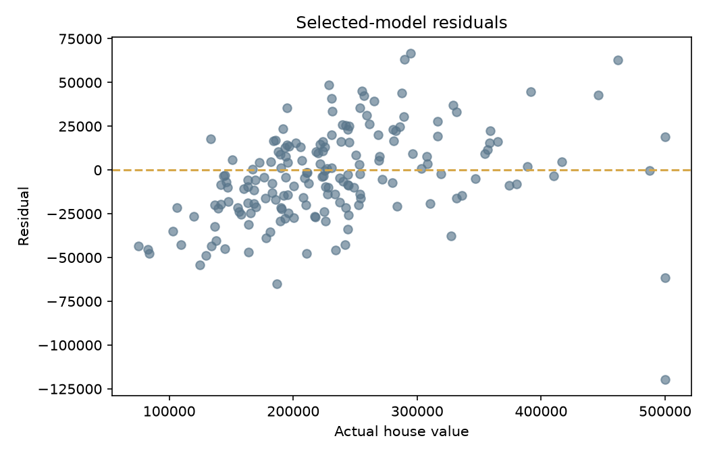

# House Price Predictor

Reproducible house-value regression using a California-housing-shaped offline dataset, train-only preprocessing, baseline and gradient-boosted model comparison, saved inference pipeline, CLI, and FastAPI API.

## Results

On the deterministic 900-row sample with a fixed 80/20 split, Ridge was selected over the tuned histogram gradient regressor: RMSE $26,615.82, MAE $20,612.86, and R² 0.8923. The gradient benchmark scored RMSE $29,634.84 and R² 0.8665. The application transparently serves the better held-out model, not the model with the more complex name.



## Quick start

```bash
python3.12 -m venv .venv
.venv/bin/python -m pip install -e '.[dev]'
.venv/bin/python scripts/generate_sample_data.py
.venv/bin/house-price train
MPLCONFIGDIR=/tmp/house-matplotlib .venv/bin/python scripts/generate_reports.py
.venv/bin/python -m pytest
```

```bash
.venv/bin/house-price predict examples/prediction-request.json
.venv/bin/uvicorn house_price_predictor.api:app --port 8000
```

`POST /predict` validates numeric ranges and accepts nullable `total_bedrooms` and `ocean_proximity`; pipeline imputers handle missing values using training-only statistics. `GET /health` validates artifact availability.

## Design notes

- A fixed seed produces a reproducible train/test split.
- `ColumnTransformer` fits medians, category modes, scaling, and one-hot encoding only on the training partition.
- The artifact contains preprocessing plus both models and selects the lower-RMSE holdout candidate.
- The committed dataset is deterministic synthetic fallback data with California Housing-compatible fields. It is for software validation and education, not property valuation advice.

Read [architecture](docs/ARCHITECTURE.md), [data card](docs/DATA_CARD.md), and [model card](docs/MODEL_CARD.md) for scope and limitations.
